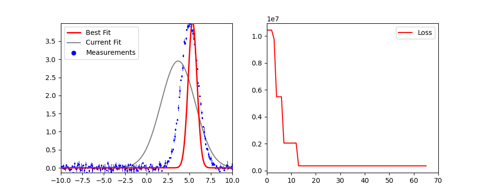

# Bayesian Optimization Application
This repository was created by Benedikt M. during his internship at Helmholtz Institut Hereon. It provides live plots of parameter evolution, loss function tracking, and corner plots for parameter correlation visualization.
Alles klar, ich habe das README um einen Abschnitt ergänzt, der den **didaktischen Nutzen vs. Forschungsnutzen** klar erklärt:

---

## Features

* Bayesian optimization with **customizable acquisition functions**.
* Supports **multiple test cases**:

  1. Gaussian peak fitting
  2. Sine function fitting
  3. Quadratic function fitting
* Interactive live plots:

  * Measurement vs. model comparison
  * Loss function evolution
  * Parameter evolution
* Corner plots to visualize parameter correlations.
* Continue optimization interactively after a block of iterations.
* Logging of all events for reproducibility.




---

## Installation

```bash
git clone <https://github.com/benemues/bayes_opt>
cd SusiBO
```

**Dependencies:**

* Python ≥ 3.9
* `numpy`
* `matplotlib`
* `corner`
* `bayes_opt`

---

## Usage

```python
from susibo import SusiBO

# Choose a test case (0, 1, or 2)
TEST = 0

# Initialize SusiBO with number of initial random points and iterations per block
susi = SusiBO(test=TEST, init_points=50, n_iter=70)

# Run optimization
susi.run()
```

During optimization, you can choose to continue with additional iterations after each block.

---

## Methods

* `run()` — Start the Bayesian optimization.
* `continue_fitting()` — Continue after user confirmation.
* `get_current_params()` — Get the most recent evaluated parameters.
* `plot_param_evolution()` — Visualize the evolution of parameters during optimization.
* `plott_corner()` — Corner plot of parameters.
* `plot_loss_()` — Loss function as a function of one parameter.
* `plot_bo()` — Bayesian optimization model predictions vs true loss.

---

## Test Cases

| Test | Function  | Parameters      |
| ---- | --------- | --------------- |
| 0    | Gaussian  | `xc`, `a`, `w`  |
| 1    | Sine      | `a`, `nu`, `ph` |
| 2    | Quadratic | `a`, `b`, `c`   |

---

## Educational vs. Research Use

**Important:** SusiBO is mainly designed for **learning and demonstration** purposes.

* **Educational Value:**

  * Understand how Bayesian Optimization works with Gaussian Processes.
  * Observe the effect of acquisition functions on exploration vs. exploitation.
  * Track parameter evolution and correlations interactively.

* **Research Use:**

  * For synthetic test cases with known functions, BO does **not provide an advantage** over direct fitting methods (e.g., least squares).
  * To use BO effectively in research, the method should be applied to **real experimental data or unknown/complex functions** where classical fits fail or are unreliable.

---

## License

MIT License — free for academic and personal use.

---

